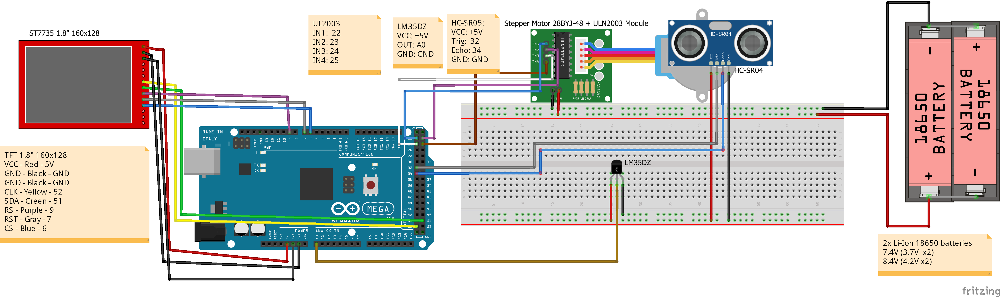
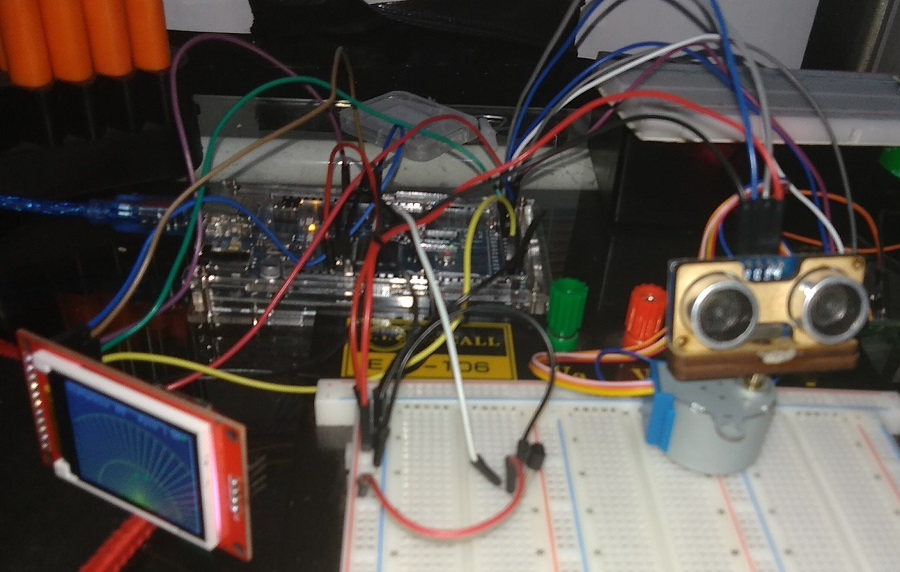
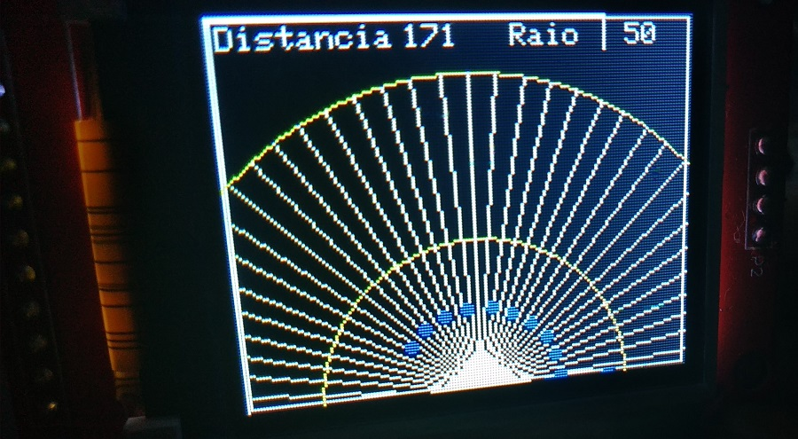

# Sonar Using SR-HC04 Ultrasonic Distance Sensor, 28BYJ-48 Stepper Motor and ST7735 TFT Display       
         
# Libraries in the project:         
 - Library to control the Stepper Motor 28BYJ-48 and Module ULN2003: ** Library `CheapStepper.h`**.       
 - Library to control the SR-HC04 Ultasonic distance sensor module: None, the distance is calculated using the following 2 functions       
	- **`ultrasound_t_echo()`**: Returns the echo time in microseconds.      
	- **`ultrasound_cm()`**: Calculates the distance in cm.     
 - Libraries to control the ST7735 TFT display:        
	- **`Adafruit_ST7735.h`**      
	- **`Adafruit_GFX.h`**      
      

# Component list:         
 - Arduino Mega 2560 board         
 - LM35DZ temperature sensor     
 - SR-HC04 Ultrasonic distance sensor       
 - 28BYJ-48 Stepper motor with ULN2003 driver module      
 - ST7735 1.8"  160x128 TFT display      
      

# Circuit Diagram:       
         
        

# Output in the TFT display:       
         
      
         
        

# Video:      
 - File **`Video_Project_Working.mp4`**       
          
